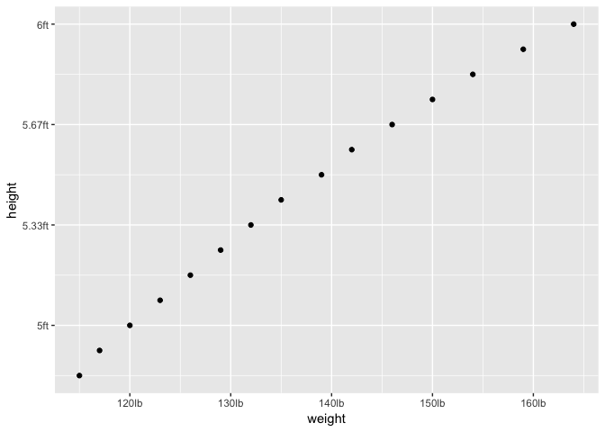

<!-- README.md is generated from README.Rmd. Please edit that file -->

# unitscales

<!-- badges: start -->

[](https://travis-ci.org/EmilHvitfeldt/unitscales)
[](https://codecov.io/gh/EmilHvitfeldt/unitscales?branch=master)
<!-- badges: end -->

The goal of unitscales is to add commonly used scale transformation to
[ggplot2](https://ggplot2.tidyverse.org/).

## Installation

<!--
You can install the released version of unitscales from [CRAN](https://CRAN.R-project.org) with:

``` r
install.packages("unitscales")
```

And the development version from [GitHub](https://github.com/) with:
-->

The development version is available from [GitHub](https://github.com/)
with:

``` r
# install.packages("devtools")
devtools::install_github("EmilHvitfeldt/unitscales")
```

## Example

This is a basic example which shows you how to solve a common problem:

``` r
library(ggplot2)
#> Registered S3 methods overwritten by 'ggplot2':
#>   method         from 
#>   [.quosures     rlang
#>   c.quosures     rlang
#>   print.quosures rlang
library(unitscales)
```

``` r
ggplot(women, aes(weight, height)) +
  geom_point() +
  scale_y_length(base = "inch", system = "imperial", ignore = "yard") +
  scale_x_mass(base = "pound", system = "imperial")
```

 q
